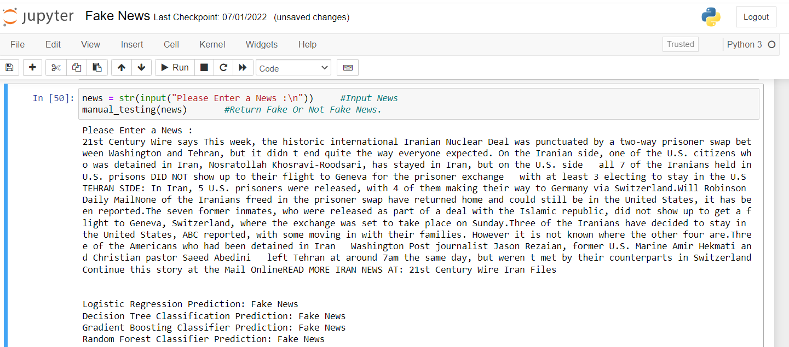

# Fake-News-Detection

# Introduction
The term “Fake News” was a lot less unheard of and not prevalent a couple of decades ago but in this digital era of social media, it has surfaced as a huge monster. Fake news, information bubbles, news manipulation and the lack of trust in the media are growing problems within our society. However, in order to start addressing this problem, an in-depth understanding of fake news and its origins is required. Only then one can look into the different techniques and fields of machine learning, natural language processing and artificial intelligence that could help us fight this situation “Fake news” has been used in a multitude of ways in the last half a year and multiple definitions have been given. 

# Definition
Fake news's simple meaning is to incorporate information that leads people to the wrong path. Nowadays fake news spreading like water and people share this information without verifying it. This is often done to further or impose certain ideas and is often achieved with political agendas.

# Tools and Libraries
In python fake news detection project, I use the following libraries:  
* Jupyter Notebook.    
* Python.   
* Pandas.   
* Numpy.     
* Scikit-learn.    

# Workflow

# Screenshot
## Fake News

## Not Fake News

